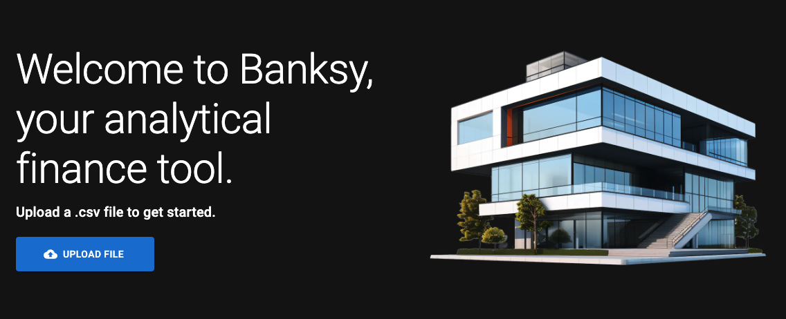

<h1 align="center">Welcome to Banksy 👋</h1>

  
   
   
   

> Welcome to Banksy, your analytical financial tool.

### 🏠 [Homepage](https://banksyy.vercel.app/)

## Description

Banksy is a finance tool that allows users to sort their spending into customizable categories and views to better understand their spending. Users follow a multi-step form that automatically assigns categories by default, with the option to change them as needed. The transactions are then compiled into views that compare different metrics (i.e. % by category, needs vs. wants). Users can then submit the statistics from those transactions to the database to compare them to each other on a monthly basis.

## Tech Stack

- Next.js
- Postgres (Vercel)
- Material UI

## Version History

### v1

- Process CSV into default categories
- View spending breakdown by category/default views
- Store summaries in table (user authentication required)

## Future Releases

- Place for custom filters (for example, don't mark gas station purchases under $10 because it was probably a convenience store purchase)
- Section to take notes (if you know for sure that a specific charge on your account will be marked wrong)
- More extensive summary view
- Forms for new banks, keywords, categories, and views
- Better error handling

## Biggest Challenges of Project

- Global and local state handling via useContext
- Creating queue for message handling (when multiple messages would occur simultaneously)
- Figuring out workflow for user experience
- Data structure for summary views
- Protecting API routes with JWT

## Author

👤 **John Gaynor**

- Portfolio: https://johngaynor.dev
- Github: [@johngaynor](https://github.com/johngaynor)
- LinkedIn: [@john-gaynor1](https://linkedin.com/in/john-gaynor1)

---

_This README was generated with ❤️ by [readme-md-generator](https://github.com/kefranabg/readme-md-generator)_
